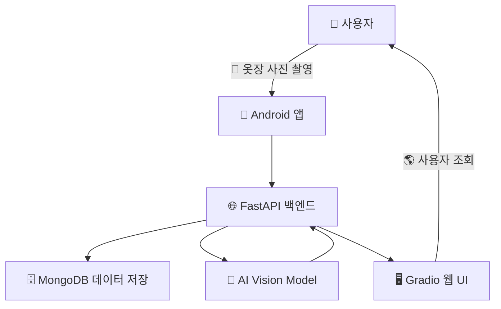

---

# 👕 **옷픈소스 (Otpensource) - 스마트 옷장 AI 시스템**  

> **AI 기반 스마트 옷장 관리 솔루션**  
> **"옷장에 옷을 걸기만 하면 AI가 자동으로 분석! 이제 옷장을 열지 않아도 내 옷을 한눈에 확인하세요."**  

---

## 📌 **프로젝트 개요**  

**옷픈소스(Otpensource)**는 **AI 기반 패션 관리 시스템**으로, 사용자의 옷을 **자동으로 인식 및 분류**하고 **효율적으로 관리**할 수 있도록 돕는 스마트 옷장 서비스입니다.  

- **사용자가 옷을 걸면 AI가 자동 분석** → 카테고리, 색상, 재질, 패턴 감지  
- **Android 앱과 연동** → 모바일에서 옷장 정보 확인 및 관리  
- **Hugging Face에 직접 학습한 AI 모델 배포**  
- **패션 데이터셋 구축** → 데이터 기반 AI 모델 학습  

> 🏆 **궁극적인 목표:**  
> 👉 **스마트 옷장 + 패션 커뮤니티 + AI 기반 코디 추천**  

---

## ✨ **주요 기능**  

✅ **📷 AI 기반 옷 인식**  
  - **카메라로 촬영한 옷을 AI가 자동으로 분석** → 종류, 색상, 재질, 패턴 감지  
  - 자체 구축한 패션 데이터셋을 활용하여 **Hugging Face AI 모델 학습**  

✅ **📲 스마트 옷장 관리 (Android 연동)**  
  - Android 앱에서 **옷을 추가/삭제/수정** 및 **카테고리별 정렬 가능**  
  - AI 분석 데이터와 함께 **사이즈, 브랜드, 구매 정보 입력** 가능  

✅ **🎨 브랜드 & 패션 스타일 인식**  
  - **로고 및 디자인 패턴 분석**을 통한 브랜드 구분  
  - 사용자의 스타일을 분석하고 **맞춤형 패션 추천 제공**  

✅ **🛒 쇼핑몰 연동 & 스타일 추천**  
  - **AI가 패션 트렌드 분석** 후 맞춤형 스타일 추천  
  - 구매한 옷을 자동 등록하여 기존 옷장과 통합 관리  

✅ **👥 패션 커뮤니티 & 스타일 공유**  
  - 내 옷장을 공유하고 **다른 유저들과 코디 추천**  
  - 비슷한 체형/스타일을 가진 유저와 **패션 스타일 비교 가능**  

✅ **📊 옷장 통계 분석 & AI 패션 추천**  
  - AI가 사용자의 **옷장 데이터를 분석**하고 **스타일 인사이트 제공**  
  - 계절별 선호 스타일, 자주 입는 옷 추천  

---

## 🏗️ **프로젝트 아키텍처**  



✔ **Android 앱** → 사용자가 **옷을 관리**하고 AI 데이터를 확인하는 모바일 인터페이스  
✔ **FastAPI 백엔드** → AI 분석 요청 처리, 데이터 저장 및 관리  
✔ **MongoDB** → 유저 데이터 & 옷장 정보를 저장하는 NoSQL 데이터베이스  
✔ **AI Vision 모델** → 자체 학습한 모델이 **옷의 종류, 색상, 패턴 감지**  
✔ **Gradio 웹 UI** → 옷장 정보를 **웹 브라우저에서 조회 가능**  

---

## 🔧 **기술 스택**  

### **🛠 Backend**
- **FastAPI** – 고성능 비동기 REST API  
- **Uvicorn** – FastAPI 실행 서버  
- **MongoDB + PyMongo** – 데이터 저장 및 관리  
- **Docker & Kubernetes** – 배포 및 운영 자동화  
- **NGINX** – 웹 서버 및 로드 밸런싱  

### **🤖 AI Model**
- **Hugging Face Transformers** – 딥러닝 모델 학습  
- **Unsloth** – LoRA 기반 경량화 학습 최적화  
- **PyTorch** – AI 모델 훈련 및 추론  
- **TRL (Hugging Face)** – 강화 학습 및 파인튜닝 지원  

### **🌐 Frontend**
- **Gradio** – 머신러닝 UI 프레임워크  
- **Pillow** – 이미지 처리 라이브러리  
- **Scikit-Learn** – 데이터 분석 및 모델 평가  

### **📡 데이터 크롤링**
- **Selenium** – 웹 브라우저 자동화  
- **BeautifulSoup4** – HTML 데이터 크롤링  
- **Requests** – HTTP 요청 라이브러리  
- **Pandas** – 데이터 정렬 및 처리  

### **📱 Android App**
- **Jetpack Compose** – 최신 UI 빌드  
- **Retrofit** – 네트워크 통신 관리  
- **ML Kit** – Google 머신러닝 SDK 활용  

---

## 🎯 **Hugging Face 모델 & 데이터셋**  

### **👕 AI Vision Model**  
🔗 [otpensource-vision](https://huggingface.co/hateslopacademy/otpensource-vision)  
✅ 자체 학습한 **Vision-Language 모델**로, 옷의 종류, 색상, 패턴을 분석 가능  

### **📊 패션 데이터셋**  
🔗 [otpensource_dataset](https://huggingface.co/datasets/hateslopacademy/otpensource_dataset)  
✅ 무신사 크롤링 데이터를 기반으로 구축된 **패션 분석 특화 데이터셋**  

---

## 📥 **설치 및 실행 방법**  

### 1️⃣ **백엔드 (FastAPI 서버 실행)**  
```bash
git clone https://github.com/hateslopacademy/otpensource.git
cd otpensource/backend
pip install -r requirements.txt
uvicorn main:app --host 0.0.0.0 --port 8000
```

### 2️⃣ **웹 UI 실행 (Gradio)**
```bash
cd otpensource/frontend
python demo.py
```
👉 브라우저에서 `http://localhost:7860` 접속  

---

## 📌 **사용 예시**  

### **👕 AI 분석 결과 예시**
```json
{
  "category": "트렌치코트",
  "gender": "여성",
  "season": "봄/가을",
  "color": "네이비",
  "material": "면",
  "feature": "클래식 디자인, 벨트 포함"
}
```


### 📡 **옷장 전체 데이터 조회**
bash
GET http://localhost:8000/get_all_clothing

```json
{
  "clothes": [
    "id": "67a0c950454c50b822b6a624",
    "big_category": "상의",
    "sub_category": "롱슬리브",
    "gender": "남",
    "season": "사계절",
    "color": "화이트",
    "material": "면",
    "feature": " 스트라이프",
    "image_base64": "/9j/4AAQSkZJRgABAAAD/4gHYSUNDX1AQEAAAAABtbn…",
    "embedding_vector": Array (512),
    created_at: 2025-02-03T13:50:10.540+00:00,
    updated_at: 2025-02-03T13:50:10.540+00:00,
    count: 4
  ]
}
```

---

## 🎨 **프로젝트 화면 예시**  

### 📷 **AI 이미지 분석**  
<p align="center">
  
</p>

### 🏠 **스마트 옷장 관리 (Gradio UI)**  
<p align="center">
  
</p>

---

## 📜 **라이선스**  
이 프로젝트는 `Apache-2.0` 라이선스를 따릅니다.  

---

## 📢 **기여 방법**  
🙌 **Pull Request & Issue 환영!**  
- 새로운 기능 제안  
- 버그 리포트  
- 문서 개선  

---

## 📞 **문의 & 피드백**  
- **이메일:** hateslop@gmail.com  

---
